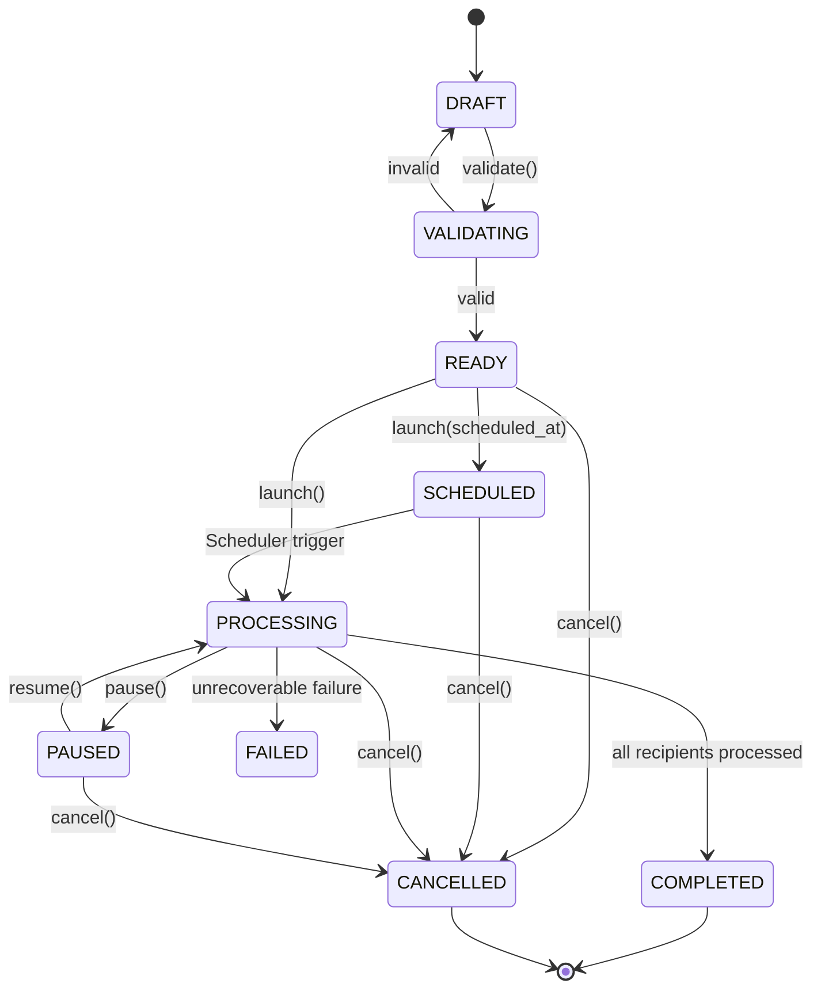

# BET CRM — SISTEMA DE CAMPANHAS DE COMUNICAÇÃO
**Documentação Técnica & Manual de Arquitetura da Fase 8**

---

## 1. Visão Geral e Propósito

O **Sistema de Campanhas** do BET CRM é o módulo orquestrador responsável por conectar todos os subsistemas construídos nas fases anteriores:

```text
PLAYERS (Fase 3)
    ↓
SEGMENTS (Fase 5)
    ↓
TEMPLATES (Fase 6)
    ↓
PROVIDERS (Fase 7)
    ↓
MESSAGES (Fase 7)
    ↓
QUEUE / HORIZON (Fase 1)
```

Uma campanha transforma a combinação de **Público (Segmento) + Mensagem (Template) + Canal (Email/SMS) + Gateway (Provider) + Agendamento** em mensagens individuais processadas assincronamente através de workers dedicados do Laravel Horizon.

---

## 2. Princípios Arquiteturais Inegociáveis

### 2.1. O Princípio da Separação de Responsabilidades
- Uma campanha **NUNCA** acessa APIs externas de mensageria diretamente.
- O fluxo de criação de mensagens delega obrigatoriamente para o `MessageService::send()`.
- O `MessageService` cria o registro na tabela `messages` e enfileira o `SendMessageJob` na fila `messages`.

### 2.2. Imutabilidade do Snapshot de Audiência
- No momento do lançamento da campanha (`launch`), a audiência é congelada na tabela `campaign_recipients`.
- Alterações futuras nos jogadores ou nas regras do segmento **não afetam** campanhas já em processamento ou concluídas.

### 2.3. Governança Mandatória de LGPD & Consentimento
- Antes de enfileirar qualquer mensagem, o sistema verifica o consentimento explícito do jogador no canal específico (`Player::hasMarketingConsent($channel)`).
- Jogadores sem consentimento ativo ou com status bloqueado são gravados no snapshot com status `SKIPPED` e motivo registrado (`MARKETING_CONSENT_REQUIRED`, `PLAYER_BLOCKED`), garantindo rastreabilidade e auditoria jurídica.

### 2.4. Deduplicação Estrita e Idempotência Dupla
- A tabela `campaign_recipients` possui constraint única composta: `UNIQUE (campaign_id, player_id)`.
- Toda mensagem gerada recebe uma chave de idempotência determinística:
  `campaign:{campaign_id}:player:{player_id}:channel:{channel}`
- Disparos acidentais ou reprocessamentos não resultam em mensagens duplicadas.

---

## 3. Máquina de Estados Finita (FSM)



### Matriz de Transições Válidas:
| Status Atual | Transições Permitidas |
| :--- | :--- |
| `DRAFT` | `VALIDATING`, `READY`, `CANCELLED` |
| `VALIDATING` | `READY`, `DRAFT`, `FAILED` |
| `READY` | `SCHEDULED`, `PROCESSING`, `DRAFT`, `CANCELLED` |
| `SCHEDULED` | `PROCESSING`, `READY`, `CANCELLED` |
| `PROCESSING` | `PAUSED`, `COMPLETED`, `FAILED`, `CANCELLED` |
| `PAUSED` | `PROCESSING`, `CANCELLED` |
| `COMPLETED` | *(Nenhuma - estado final)* |
| `CANCELLED` | *(Nenhuma - estado final)* |
| `FAILED` | `DRAFT` |

---

## 4. Pipeline de Processamento em Lote (Jobs)

```text
[HTTP POST /campaigns/{id}/launch]
               │ (Lock Atômico Redis: campaign:launch:{id})
               ▼
       [DispatchCampaignJob] ──► Fila: 'campaigns'
               │
               ├─► Valida isolamento e consistência
               ├─► Transiciona status para 'PROCESSING'
               ├─► Processa jogadores do segmento em chunks de 500
               ├─► Cria registros em 'campaign_recipients'
               │     ├─► Elegível: status = 'PENDING'
               │     └─► Sem consentimento/bloqueado: status = 'SKIPPED'
               └─► Dispara 'CreateCampaignMessagesJob'
                               │
                               ▼
               [CreateCampaignMessagesJob] ──► Fila: 'campaign_messages'
                               │
                               ├─► Processa recipients 'PENDING' em chunks de 250
                               ├─► Verifica se campanha foi PAUSADA ou CANCELADA
                               ├─► Renderiza Template com variáveis do jogador
                               ├─► Chama MessageService::send()
                               ├─► Atualiza recipient para 'QUEUED'
                               └─► Quando 0 PENDING: marca campanha como 'COMPLETED'
```

---

## 5. Dicionário de Tabelas do Banco de Dados

### 5.1. `campaigns`
Armazena a entidade raiz da campanha:
- `id` (bigserial, PK)
- `uuid` (uuid, unique)
- `platform_id` (foreign key -> `platforms.id`)
- `name` (varchar 191)
- `description` (text, nullable)
- `channel` (varchar 20: `EMAIL`, `SMS`)
- `status` (varchar 30: `DRAFT`, `VALIDATING`, `READY`, `SCHEDULED`, `PROCESSING`, `PAUSED`, `COMPLETED`, `CANCELLED`, `FAILED`)
- `segment_id` (foreign key -> `segments.id`)
- `template_id` (foreign key -> `templates.id`)
- `template_version_id` (foreign key -> `template_versions.id`)
- `provider_id` (foreign key -> `providers.id`, nullable)
- `scheduled_at` (timestamp, nullable)
- `from_name` / `from_email` (varchar, nullable)
- `total_recipients` / `messages_created` / `messages_sent` / `messages_delivered` / `messages_failed` (integer)
- `started_at` / `completed_at` / `paused_at` / `cancelled_at` (timestamp, nullable)
- `created_by` / `updated_by` (foreign key -> `users.id`, nullable)
- `created_at` / `updated_at` / `deleted_at` (timestamps)

### 5.2. `campaign_recipients`
Snapshot congelado de jogadores da campanha:
- `id` (bigserial, PK)
- `uuid` (uuid, unique)
- `campaign_id` (foreign key -> `campaigns.id`, cascade delete)
- `platform_id` (foreign key -> `platforms.id`)
- `player_id` (foreign key -> `players.id`)
- `channel` (varchar 20)
- `recipient` (varchar 191 - e-mail ou telefone)
- `status` (varchar 30: `PENDING`, `QUEUED`, `SENT`, `DELIVERED`, `FAILED`, `SKIPPED`)
- `reason` (varchar 100, nullable: ex: `MARKETING_CONSENT_REQUIRED`, `INVALID_CONTACT`)
- `error_message` (text, nullable)
- `created_at` / `updated_at` (timestamps)
- **Constraint Única**: `UNIQUE (campaign_id, player_id)`

### 5.3. Alteração na tabela `messages`
- Adição da coluna `campaign_id` (foreign key nullable -> `campaigns.id`, indexado).

---

## 6. Rotas da API REST (`/api/v1`)

| Método | Endpoint | Ação / Controller | Permissão RBAC |
| :--- | :--- | :--- | :--- |
| `GET` | `/campaigns` | Listagem com filtros e paginação | `campaigns.view` |
| `POST` | `/campaigns` | Criação em status `DRAFT` | `campaigns.create` |
| `GET` | `/campaigns/{id}` | Ficha 360° da campanha | `campaigns.view` |
| `PUT` | `/campaigns/{id}` | Edição (somente `DRAFT` ou `READY`) | `campaigns.update` |
| `DELETE` | `/campaigns/{id}` | Soft delete (somente `DRAFT`) | `campaigns.delete` |
| `POST` | `/campaigns/{id}/validate` | Validação de pré-requisitos | `campaigns.validate` |
| `POST` | `/campaigns/{id}/preview` | Renderização de amostra | `campaigns.preview` |
| `POST` | `/campaigns/{id}/test` | Envio de teste administrativo | `campaigns.test` |
| `POST` | `/campaigns/{id}/launch` | Disparo/agendamento com confirmação | `campaigns.launch` |
| `POST` | `/campaigns/{id}/pause` | Pausa disparo em processamento | `campaigns.pause` |
| `POST` | `/campaigns/{id}/resume` | Retoma disparo pausado | `campaigns.resume` |
| `POST` | `/campaigns/{id}/cancel` | Cancela campanha definitivamente | `campaigns.cancel` |
| `GET` | `/campaigns/{id}/recipients` | Lista snapshot com mascaramento LGPD | `campaigns.recipients` |
| `GET` | `/campaigns/{id}/messages` | Lista mensagens geradas | `campaigns.messages` |
| `GET` | `/campaigns/{id}/stats` | Estatísticas e taxas em tempo real | `campaigns.stats` |
