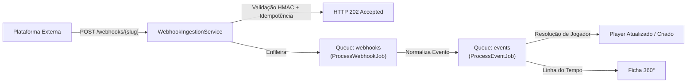

# BET CRM — Relatório de Conclusão da FASE 4

**Módulo**: Ingestão de Webhooks & Eventos Externos  
**Data de Conclusão**: 01/10/2026  
**Status**: 100% Concluído, Integrado e Validado  

---

## 1. Resumo Executivo da Fase 4

A **FASE 4** do projeto **BET CRM** implementou a infraestrutura completa de **Ingestão de Webhooks & Eventos Externos**, habilitando a plataforma a receber, autenticar, desduplicar, normalizar e processar assincronamente fluxos contínuos de eventos oriundos de operadoras de apostas e cassinos online.

### Pilares Fundamentais Atendidos:
1. **Endpoint de Ingestão de Alta Disponibilidade**: `POST /api/v1/webhooks/{platform_slug}` com resposta instantânea `HTTP 202 Accepted` (< 20ms) e desacoplamento total do processamento de negócio via filas Redis.
2. **Segurança Criptográfica HMAC-SHA256**: Validação rigorosa de assinatura calculada estritamente sobre o **RAW BODY** da requisição com proteção contra *timing attacks* (`hash_equals()`).
3. **Idempotência Física & Lógica Dupla**: Chave única `platform_id + external_event_id` garantida no banco de dados e checagem rápida no Redis (`betcrm:idempotency:{platform_id}:{event_id}`), impedindo processamento redundante ou replicação indevida de dados.
4. **Normalização Genérica (`EventNormalizer`)**: Conversão padronizada de formatos heterogêneos para tipos canônicos internos (`PLAYER_CREATED`, `PLAYER_UPDATED`, `DEPOSIT_SUCCESS`, `BET_PLACED`, `BET_SETTLED`, `WITHDRAWAL_SUCCESS`, `LOGIN`), assegurando precisão decimal estrita em transações monetárias (sem `FLOAT`).
5. **Resolução Segura de Jogadores (`PlayerResolution`)**:
   - Vínculo automático de eventos a jogadores existentes;
   - Provisão segura em eventos cadastrais (`PLAYER_CREATED`);
   - Bloqueio de criação silenciosa/indesejada em eventos transacionais (`deposit`, `bet`, `withdrawal`) com marcação explícita de status `PLAYER_NOT_FOUND`.
6. **Integração com a Ficha 360°**: Os eventos normalizados alimentam dinamicamente a linha do tempo (timeline) do jogador no CRM.
7. **Frontend Next.js 15 Completo**:
   - Tela `/events`: Dashboard analítico de eventos, métricas em tempo real, filtros dinâmicos e modal de inspeção comparativa (Raw Payload vs Normalized Payload);
   - Tela `/webhooks`: Histórico de requisições HTTP e ferramenta interativa **Webhook Tester** com geração automática de HMAC-SHA256 para simulação local;
   - Reprocessamento administrativo sob demanda (`POST /api/v1/events/{id}/reprocess`).
8. **100% da Suíte de Testes Automatizados Aprovada**: 81 testes no PHPUnit (321 asserções) cobrindo Fases 1, 2, 3 e 4 com 0 falhas ou regressões.

---

## 2. Arquivos Criados

### Backend (Laravel 12)
1. `backend/database/migrations/2026_10_01_000003_create_webhooks_and_events_tables.php` — Migration com tabelas `event_types`, `events` e `webhook_logs`.
2. `backend/database/seeders/EventTypeSeeder.php` — Cadastro dos tipos de eventos canônicos do sistema.
3. `backend/app/Enums/EventProcessingStatus.php` — Enum tipado com os estados: `RECEIVED`, `QUEUED`, `PROCESSING`, `PROCESSED`, `DUPLICATE`, `FAILED`, `PLAYER_NOT_FOUND`, `INVALID_SIGNATURE`, `INVALID_PAYLOAD`.
4. `backend/app/Models/EventType.php` — Modelo Eloquent para tipos de eventos suportados.
5. `backend/app/Models/Event.php` — Modelo Eloquent com traits `BelongsToPlatform`, UUIDv7 e cast de payloads JSONB.
6. `backend/app/Models/WebhookLog.php` — Modelo Eloquent para auditoria de requisições de webhooks.
7. `backend/app/Services/Webhooks/WebhookSecurityService.php` — Validação de assinatura HMAC-SHA256, cálculo de hashes e mascaramento de cabeçalhos confidenciais.
8. `backend/app/Services/Webhooks/EventNormalizer.php` — Normalizador de eventos externos, datas UTC e precisão financeira decimal.
9. `backend/app/Services/Webhooks/IdempotencyService.php` — Serviço de verificação de duplicidade com fast-path Redis e garantia relacional.
10. `backend/app/Services/Webhooks/WebhookIngestionService.php` — Orquestrador de validação, registro em log e enfileiramento HTTP 202.
11. `backend/app/Jobs/ProcessWebhookJob.php` — Job de normalização e provisionamento do registro de evento na fila `webhooks`.
12. `backend/app/Jobs/ProcessEventJob.php` — Job de execução de efeitos colaterais e resolução de jogador na fila `events`.
13. `backend/app/Http/Controllers/Api/V1/WebhookController.php` — Controller público para o endpoint de ingestão.
14. `backend/app/Http/Controllers/Api/V1/EventController.php` — Controller administrativo para listagem, detalhes e reprocessamento de eventos.
15. `backend/app/Http/Controllers/Api/V1/WebhookLogController.php` — Controller administrativo para consulta de logs de auditoria.
16. `backend/app/Http/Resources/EventResource.php` — Resource JSON para eventos normalizados.
17. `backend/app/Http/Resources/WebhookLogResource.php` — Resource JSON para logs de requisições HTTP.
18. `backend/tests/Feature/WebhookAndEventTest.php` — Suíte de testes automatizados com 26 cenários de ingestão, segurança, idempotência e RBAC.

### Frontend (Next.js 15)
19. `frontend/services/event-service.ts` — Cliente de API com tipagem TypeScript para eventos, logs de webhook, reprocessamento e utilitário nativo de HMAC (`crypto.subtle`).
20. `frontend/app/events/page.tsx` — Painel de eventos com cards de métricas, filtros por tipo/status/data, modal de inspeção (payload cru vs normalizado) e reprocessamento.
21. `frontend/app/webhooks/page.tsx` — Aba de logs de ingestão e ferramenta integrada **Webhook Tester** com presets de eventos de apostas e disparo em tempo real.

### Documentação
22. `docs/WEBHOOK_INTEGRATION.md` — Guia técnico de integração para provedores externos com exemplos em cURL, PHP e TypeScript.

---

## 3. Arquivos Alterados

1. `backend/app/Models/Platform.php` — Adicionados relacionamentos `events()`, `eventTypes()` e `webhookLogs()`.
2. `backend/app/Models/Player.php` — Adicionado relacionamento `events()`.
3. `backend/app/Http/Resources/Player360Resource.php` — Integrados eventos reais processados na linha do tempo do apostador.
4. `backend/database/seeders/RoleAndPermissionSeeder.php` — Adicionadas permissões `events.view`, `events.reprocess` e `webhooks.view`.
5. `backend/database/seeders/DatabaseSeeder.php` — Registrado `EventTypeSeeder`.
6. `backend/app/Providers/AppServiceProvider.php` — Registrado rate limiter dinâmico isolado por plataforma (`Limit::perMinute(300)->by($platformSlug)`).
7. `backend/routes/api.php` — Registrada rota pública `POST /api/v1/webhooks/{platform_slug}` e rotas autenticadas de eventos e logs.
8. `README.md` — Atualizado com status da Fase 4.

---

## 4. Endpoints Criados

| Método | Endpoint | Autenticação | Descrição |
| :--- | :--- | :--- | :--- |
| `POST` | `/api/v1/webhooks/{platform_slug}` | **HMAC-SHA256** | Ingestão assíncrona com resposta rápida HTTP 202 |
| `GET` | `/api/v1/events` | Sanctum + RBAC (`events.view`) | Listagem com filtros compostos e paginação |
| `GET` | `/api/v1/events/{id}` | Sanctum + RBAC (`events.view`) | Detalhes completos e comparação de payloads |
| `POST` | `/api/v1/events/{id}/reprocess` | Sanctum + RBAC (`events.reprocess`) | Reenfileiramento de evento falho ou pendente |
| `GET` | `/api/v1/webhook-logs` | Sanctum + RBAC (`webhooks.view`) | Auditoria de requisições recebidas no endpoint |
| `GET` | `/api/v1/webhook-logs/{id}` | Sanctum + RBAC (`webhooks.view`) | Inspeção de cabeçalhos mascarados e payload |

---

## 5. Arquitetura de Filas e Resiliência



- **Fila `webhooks`**: Executa a normalização do JSON cru e a persistência na tabela `events` com `attempts = 1`.
- **Fila `events`**: Executa os efeitos de negócio no jogador e marca o status final (`PROCESSED`, `PLAYER_NOT_FOUND`, `FAILED`).
- **Política de Retentativas (Retry)**: 3 tentativas com backoff progressivo (`[10, 60, 300]` segundos).
- **Dead Letter**: Falhas definitivas permanecem armazenadas com motivo do erro para posterior auditoria ou reprocessamento manual via UI.

---

## 6. Resultados dos Testes Automatizados

### Suíte Completa do PHPUnit 11:
```text
PHPUnit 11.5.56 by Sebastian Bergmann and contributors.

Runtime:       PHP 8.3.31
Configuration: X:\OPUSS DIGITAL\OPUSS CRM\backend\phpunit.xml

................................................................. 65 / 81 ( 80%)
................                                                  81 / 81 (100%)

Time: 00:29.258, Memory: 56.00 MB

OK (81 tests, 321 assertions)
```

- **Fase 1 (Foundation)**: 10 testes
- **Fase 2 (Auth & RBAC)**: 20 testes
- **Fase 3 (Players & 360)**: 25 testes
- **Fase 4 (Webhooks & Events)**: 26 testes
- **Total**: **81 testes / 321 asserções — 100% GREEN**.

---

## 7. Compilação de Produção do Frontend (Next.js 15)

```text
Route (app)                                 Size  First Load JS
┌ ○ /                                    5.13 kB         116 kB
├ ○ /_not-found                            996 B         104 kB
├ ○ /events                              6.96 kB         118 kB
├ ○ /login                                4.6 kB         107 kB
├ ○ /players                             6.33 kB         117 kB
├ ƒ /players/[id]                        7.06 kB         118 kB
├ ƒ /players/[id]/edit                   5.22 kB         116 kB
├ ○ /players/new                         5.47 kB         116 kB
├ ○ /profile                             3.35 kB         111 kB
└ ○ /webhooks                            7.23 kB         118 kB
+ First Load JS shared by all             103 kB

✓ Compiled successfully in 5.3s (0 TypeScript errors)
```

---

## 8. Status Final & Próximos Passos

A **FASE 4** está formalmente **concluída e validada**.

Seguindo as diretrizes do projeto, nenhuma funcionalidade da **FASE 5** (Motor de Segmentação Dinâmica & Filtros Avançados) foi iniciada.

Aguardando sua autorização para prosseguir para a Fase 5!
